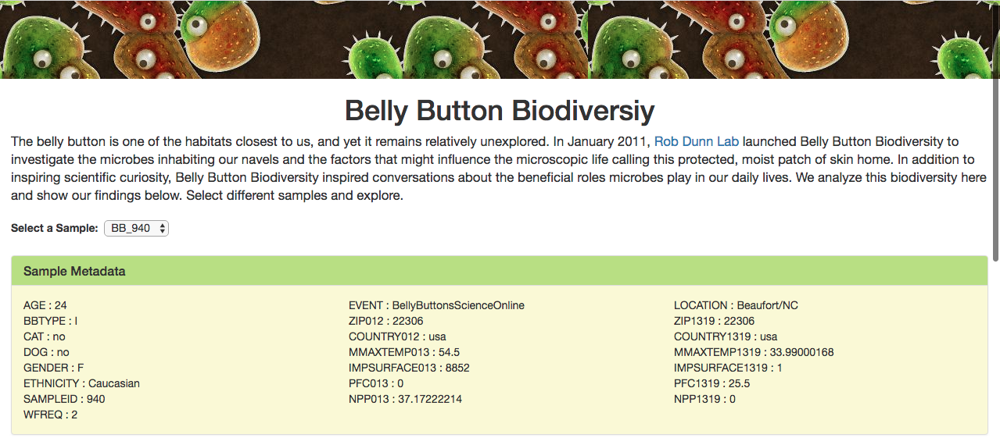
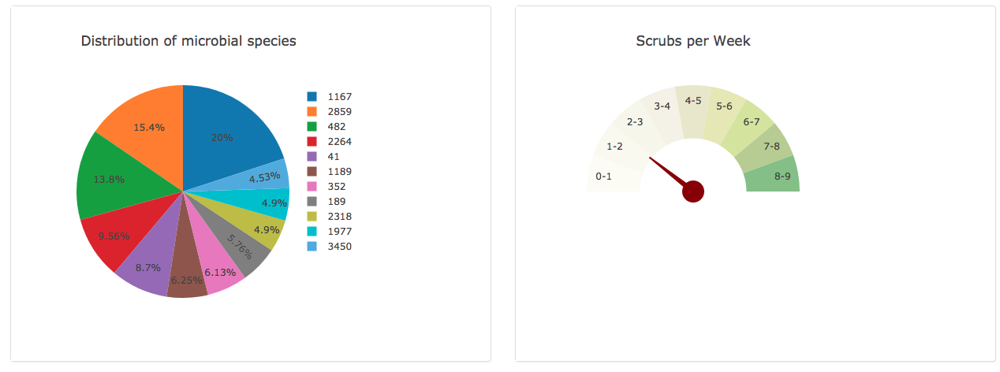
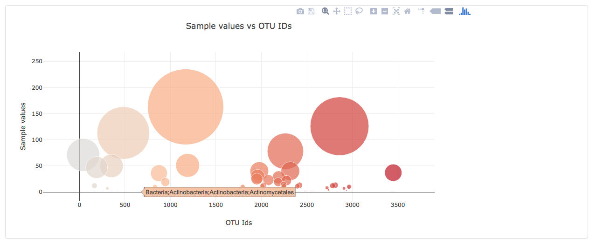

# BellyButtonBiodiversity
The belly button is one of the habitats closest to us, and yet it remains relatively unexplored. In January 2011, Rob Dunn Lab launched Belly Button Biodiversity to investigate the microbes inhabiting our navels and the factors that might influence the microscopic life calling this protected, moist patch of skin home. In addition to inspiring scientific curiosity, Belly Button Biodiversity inspired conversations about the beneficial roles microbes play in our daily lives. We analyze this biodiversity here and show our findings.

## Technical Considerations
This project showcases some interactive visualizations on Belly Button Biodiversity using Bootstrap, Plotly.js, D3, Flask and SQLAlchemy.

* Flask Application: We use a Flask Application to serve the data for our Dashboard pages. The flask routes display the data from the database tables.
* SQLite database: All of the Belly Button Biodiversity data that we have downloaded from the Rob Dunn Lab is in a SQLite database which is accessed via python's SQLAlchemy library
* FInally we use the Plotly.js javascript library to display our interractive visualizations on the HTML dashboard page. The HTML page uses bootstrap components and styles for responsiveness.
* We have deployed our Flask application on Heroku. Take a look at the link in the section below.

## Belly Button Biodiversity Dashboard
Below is the snapshot of the Belly Button Biodiversity Dashboard page.

## Working Application on Heroku
We have deployed our Flask Applicaiton on Heroku. To take a look at our running applicaiton, take a look at [Belly Button Biodiversity](https://tranquil-springs-59548.herokuapp.com/)

## References
Belly Button Biodiversity data: Project background and data for this project is taken from [Rob Dunn Labs](http://robdunnlab.com/projects/belly-button-biodiversity/)

